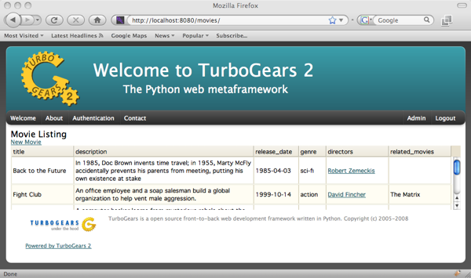

Table Tutorial
=================================

Here you can find out how to create tables with sprox, including infinitely scrolling
tables provided by Dojo.  Many of these examples will provide server code based on TurboGears2, but
sprox will work with any wsgi application you have ToscaWidgets mounted in.  We will assume
the reader is somewhat versed in TurboGears2's :class:`tg.controllers.RestController`.

Establishing the Model Definition
-----------------------------------

Let us first assume the following model for this demonstration.::

    from sqlalchemy import Column, Integer, String, Date, Text, ForeignKey, Table
    from sqlalchemy.orm import relation
    
    from moviedemo.model import DeclarativeBase, metadata
    
    movie_directors_table = Table('movie_directors', metadata,
                                  Column('movie_id', Integer, ForeignKey('movies.movie_id'), primary_key = True),
                                  Column('director_id', Integer, ForeignKey('directors.director_id'), primary_key = True))
    
    class Genre(DeclarativeBase):
        __tablename__ = "genres"
        genre_id = Column(Integer, primary_key=True)
        name = Column(String(100))
    
    class Movie(DeclarativeBase):
        __tablename__ = "movies"
        movie_id = Column(Integer, primary_key=True)
        title = Column(String(100), nullable=False)
        description = Column(Text, nullable=True)
        genre_id = Column(Integer, ForeignKey('genres.genre_id'))
        genre = relation('Genre', backref='movies')
        release_date = Column(Date, nullable=True)
    
    class Director(DeclarativeBase):
        __tablename__ = "directors"
        movie_id = Column(Integer, primary_key=True)
        title = Column(String(100), nullable=False)
        movies = relation(Movie, secondary_join=movie_directors_table, backref="directors")

Basic Table Definition
-----------------------
Here, we create a :class:`sprox.tablebase.TableBase` for the movie.::

    from tg.controllers import RestController, redirect
    from moviedemo.model import DBSession, Movie, Genre, Director
    from sprox.tablebase import TableBase
    
    class MovieTable(TableBase):
        __model__ = Movie
        
    movie_table = MovieTable(DBSession);
    
    class SproxMovieController(RestController):
    
        @expose('moviedemo.templates.sproxdemo.movies.get_all')
        def get_all(self):
            tmpl_context.widget = movie_table
            return dict()

And some template code::

    <html xmlns="http://www.w3.org/1999/xhtml"
          xmlns:py="http://genshi.edgewall.org/"
          xmlns:xi="http://www.w3.org/2001/XInclude">
      <xi:include href="master.html" />
    <head/>
    <body>
      
 &nbsp; 

      

        

          <h1 style="margin-top:1px;">Movie Listing</h1>
          <a href='new/'>New Movie</a>
          ${tmpl_context.widget()}
        

      

    </body>
    </html>

Which produces something like this:

Displaying Actual Data
-----------------------------------

Now, we have a form, but there are no entries for that form.  Lets add
a :class:`sprox.fillerbase.TableFiller` to provide data for the form.::

    from sprox.fillerbase import TableFiller
    
    class MovieTableFiller(TableFiller):
        __model__ = Movie
    
    movie_filler = MovieTableFiller(DBSession)

Then we add that to our controller method::

    @expose('moviedemo.templates.sproxdemo.movies.get_all')
    def get_all(self):
        tmpl_context.widget = movie_table
        value = movie_filler.get_value()
        return dict(value=value)

Our template's call of the widget changes like this::

      ${tmpl_context.widget(value=value)}

Resulting in the data being shown.

.. image:: images/table_values.png

You may have noticed that the genre, and directors fields are already populated.
Sprox pulls data from the relations you set up in your model definition, and displays them
according to a default set of fieldnames as provided by the :class:`sprox.viewbase.ViewBase`.  This may
be altered by providing an additional __possible_field_names__ modifier.

Removing unwanted fields
-----------------------------------

This table is not really pleasing to an end-user because of the movie_id and genre_id fields
so let's omit them.  Our table definition becomes::

    class MovieTable(TableBase):
        __model__ = Movie
        __omit_fields__ = ['movie_id', 'genre_id']

which looks like this:

You can modify the filler to omit this data also, but it is not necessary.  The view
will only view the fields specified by your TableBase class.  :class:`sprox.tablebase.TableBase` provides a number
of modifiers that allow you to define how the table is displayed.

Removing the actions field
-----------------------------------

Often times, you will want to omit the "actions" field from the table.  It may be that
you simply want to display the data, with no other allowable actions to perform.  We can
modify our table to do just that::

 class MovieTable(TableBase):
    __model__ = Movie
    __omit_fields__ = ['movie_id', 'genre_id', '__actions__']

Custom field data display
-----------------------------------
Sometimes it makes sense to provide your own data.  What would happen if we wanted to display
the Director's names as links to another page that lists the movies which they directed?  Let's
see how that would look::

    class MovieTableFiller(TableFiller):
       __model__ = Movie
       def directors(self, obj):
           directors = ', '.join(['<a href="/directors/'+str(d.director_id)+'">'+d.name+'</a>' 
                                  for d in obj.directors])
           return directors.join(('
', '
'))

    class MovieTable(TableBase):
        __model__ = Movie
        __omit_fields__ = ['movie_id', 'genre_id', '__actions__']
        __xml_fields__ = ['directors']

And now you can see the resulting directors are listed as hrefs:

There are two new features from 0.6 in this example.  The first is that you may specify any 
function in your filler, and if that function matches the name of a field in the Fillers __entity__
it will use that function to produce a string output for filling of that row of data.  The function
takes a reference to the parent object, so if you are overriding a relation (as we are in this example)
you have full access to the object's scope.

The second new feature is the modifier __xml_fields__ which tells the simple table rendering ToscaWidget
not to escape the html tags.  This allows the links to "work" in our example.

Adding a new Field
-----------------------------------

Sometimes you want to augment the field entries with one of your own.  Let's add a "similar movies" column
that displays movies of the same genre.  First, we must modify the table view to include our new column.::

    class MovieTable(TableBase):
        __model__ = Movie
        __omit_fields__ = ['movie_id', 'genre_id', '__actions__']
        __xml_fields__ = ['directors']
        __add_fields__ = {'related_movies':None}
        
    movie_table = MovieTable(DBSession);

We also need to modify the filler to include the new column, and define a function for it's display.::

    class MovieTableFiller(TableFiller):
        __model__ = Movie
        __add_fields__ = {'related_movies':None}
        def directors(self, obj):
            directors = ', '.join(['<a href="/directors/'+str(d.director_id)+'">'+d.name+'</a>' 
                                   for d in obj.directors])
            return directors.join(('
', '
'))
    
        def related_movies(self, obj):
            return ', '.join([movie.title for movie in obj.genre.movies if movie!=obj])
    
    movie_filler = MovieTableFiller(DBSession)

The resultant table should look something like this:

Changing the TableFiller's query
----------------------------------
It is likely at some point that you will want to override sprox's table querying mechanism.  Maybe you want
to provide pagination or limit the results to a specific subset of records.  Let's add a new Controller
for the directors that print's their name and displays the movies they directed.  Here's the new controller
code::
  
    class SproxDirectorController(RestController):
        
        @expose('moviedemo.templates.sproxdemo.directors.get_one')
        def get_one(self, director_id):
            tmpl_context.widget = director_movie_table
            director = DBSession.query(Director).get(director_id)
            value = director_movie_filler.get_value(director=director)
            return dict(director=director, value=value)
  

Our director template could look something like this::

    <html xmlns="http://www.w3.org/1999/xhtml"
          xmlns:py="http://genshi.edgewall.org/"
          xmlns:xi="http://www.w3.org/2001/XInclude">
      <xi:include href="master.html" />
    <head/>
    <body>
      
 &nbsp; 

      

        

          <h1>${director.name}</h1>
          <h2 style="margin-top:1px;">Movies Directed</h2>
          ${tmpl_context.widget(value=value)}
        

      

    </body>
    </html>

And our director-specific TableFiller::

    class DirectorMovieTableFiller(TableFiller):
        __model__ = Movie
        __add_fields__ = {'related_movies':None}
        
        def directors(self, obj, **kw):
            director = kw['director']
            directors = ', '.join(['<a href="/directors/'+str(d.director_id)+'">'+d.name+'</a>' 
                                   for d in obj.directors if d!=director])
            return directors.join(('
', '
'))
    
        def related_movies(self, obj):
            return ', '.join([movie.title for movie in obj.genre.movies if movie!=obj])
    
        def _do_get_provider_count_and_objs(self, director=None, **kw):
            movies = DBSession.query(Movie).filter(Movie.directors.contains(director)).all()
            return len(movies), movies

    director_movie_filler = DirectorMovieTableFiller(DBSession)

The first difference you may notice is that we have added a _do_get_provider_count_and_objs method.
This method defines how the query should be performed for the given filler.  In this case, we are
filtering only on Movies which have the indicated director.  The director value comes in from your get_value
call inside the controller.  The function returns both a length and a list of objects.  The length
is the length of all objects that may be queried, the list of objects is just those the user
wants for the given context.  This is particularly useful when designing paginated tables.

You may also notice that we have changed the directors method to
include the director in the call.  Sprox will also pass variables in from the get_value call to
your field methods if you specify parameters for those variables in your method call.

Our TableBase code is largely unchanged.::

    class DirectorMovieTable(TableBase):
        __model__ = Movie
        __omit_fields__ = ['movie_id', 'genre_id', '__actions__']
        __xml_fields__ = ['directors']
        __add_fields__ = {'related_movies':None}
        
    director_movie_table = DirectorMovieTable(DBSession);

And the resulting page.

Changing the Column Header Names
---------------------------------- 
While the column names are functional, they aren't pretty, and in the case of the director
page, it really should say "other directors".  Let's use the __headers__ modifier
and change that.::

    class DirectorMovieTable(TableBase):
        __model__ = Movie
        __omit_fields__ = ['movie_id', 'genre_id', '__actions__']
        __xml_fields__ = ['other directors']
        __add_fields__ = {'related_movies':None}
        __headers__ = {'directors': 'other directors'}
        
And the compulsory screenshot:

Adding Dojo to the mix
------------------------
Dojo is a JavaScript library that sprox uses to create tables that are infinitely scrolling.  This is 
especially handy if you don't want to go through the trouble of writing pagination code.  The first thing
we need to do is install tw.dojo, which is a toscawidget wrapper for the library::

    easy_install tw.dojo

Next we modify our Table code to utilize the sprox dojo filler and table classes::

    from sprox.dojo.tablebase import DojoTableBase as TableBase
    from sprox.dojo.fillerbase import DojoTableFiller as TableFiller
    
    class MovieTableFiller(TableFiller):
        __model__ = Movie
        __add_fields__ = {'related_movies':None}
        def directors(self, obj):
            directors = ', '.join(['<a href="/directors/'+str(d.director_id)+'">'+d.name+'</a>' 
                                   for d in obj.directors])
            return directors.join(('
', '
'))
    
        def related_movies(self, obj):
            return ', '.join([movie.title for movie in obj.genre.movies if movie!=obj])
    
    movie_filler = MovieTableFiller(DBSession)
    
    class MovieTable(TableBase):
        __model__ = Movie
        __omit_fields__ = ['movie_id', 'genre_id', '__actions__']
        __xml_fields__ = ['directors']
        __add_fields__ = {'related_movies':None}
        __url__ = "/movies.json"
        
    movie_table = MovieTable(DBSession)

Now if you take a look at our movie page you will see that there is a table, but no data:

.. image:: images/table_dojo_nodata.png

This is because dojo has a different method of obtaining the table data.  It performs an Ajax call back to the
server to retrieve a stream of data.  We need to change our controller method to publish this stream::

    class SproxDirectorController(RestController):
        
        @expose('moviedemo.templates.sproxdemo.directors.get_one')
        def get_one(self, director_id):
            tmpl_context.widget = director_movie_table
            director = DBSession.query(Director).get(director_id)
            value = director_movie_filler.get_value(director=director)
            return dict(director=director, value=value)

Once we fix this we get our data back:

Changing column widths
--------------------------

Sprox sets all column widths to 10em by default.  This will probably need to be modified in order for your
data to look right.  Here is how we do that::

    class MovieTable(TableBase):
        __model__ = Movie
        __omit_fields__ = ['movie_id', 'genre_id', '__actions__']
        __xml_fields__ = ['directors']
        __add_fields__ = {'related_movies':None}
        __column_widths__ = {'description':"30em",
                             'release_date':"7em",
                             'genre':"4em",
                             }
        __url__ = "/movies.json"

And here is how it looks after modification:

To Summarize
-------------
TableBase and TableFiller provide an easy path for display of data to a webpage.  They can be heavily
customized, especially with the advent of field_methods in 0.6, which allow you to provide a python
function for field data display.  tw.dojo gives TableFiller and TableBase with the capability to 
have an ajaxy interface with infinite scrolling.  If you'd like to review the code used to create this
tutorial, please::

    svn co http://pythontutorials.googlecode.com/svn/tutorials/moviedemo/trunk moviedemo

